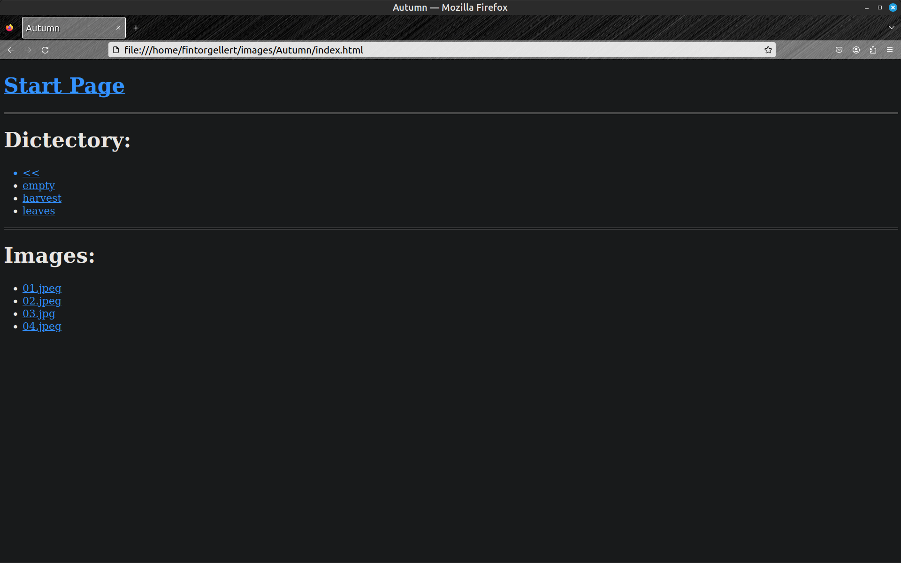
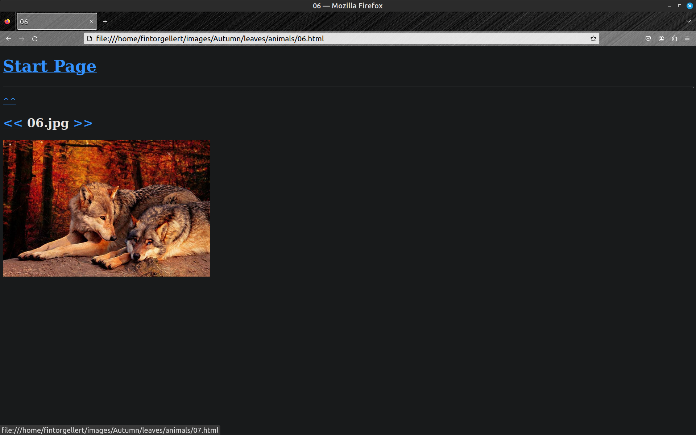

# Java HTML (Programozási nyelvek 2 - Projektfeladat)
  Statikus HTML generátor készítése képekhez.

## Feladat leírása
- hozzon létre egy képeket tartalmazó könyvtárrendszer, amely tartalmaz üres könyvtárat és különböző mélységben vannak alkönyvtárak és képek,
- a program és a könyvtárrendszer ne legyenek azonos könyvtárban és az elérési útjuk legyen különböző,
- a program futásidejű paraméterként kapja meg a képeket tartalmazó gyökérkönyvtárat,
- a program kezelje le a következő hibákat:
  - nincs paraméter átadva,
  - paraméternek egy fájl lett átadva,
- a program a rekurzív bejárással hozzon létre minden könyvtárhoz egy index.html és minden képhez egy <image_name>.html oldalt,
- az index.html oldal kinézete és működése: <br />
  
  - a "Start Page" vigyen vissza a gyökérkönyvtár index.html oldalára,
  - a "<<" vigyen az előző könyvtár index.html oldalára,
  - legyenek listázva a könyvtárak és a képek,
  - egy könyvtárra kattintva vigyen az index.html oldalára,
  - egy képre kattintva vigyen a kép html oldalára,
- a képekhez tartozó html oldal kinézete és működése: <br />
  
  - a "^^" vigyen vissza a kép könyvtárának index.html oldalára,
  - a "<<" vigyen az előző, míg a ">>" a következő kép html oldalára,
  - a képre kattintva vigyen a következő kép html oldalára,
  - ha az első vagy az utolsó képnél akarunk az előző vagy következő képre menni, akkor ne történjen semmi,
- ha megváltoztatjuk a gyökérkönyvtár elérési útját vagy a nevét, akkor is működjön a html oldal.

## Segédfájlok leírása
  A program indítását, a html oldalak törlését és a gyökérkönyvtár index.html böngészőben megnyitását két Makefile segíti.  <br />

  **Program indítását segítő Makefile és működése:**
  ```
  list:
      cat Makefile

  all:
      javac Start.java
      java Start <root_directory_path>
  ```
  <br />
  A *list* target kiiratjuk a Makefile tartalmát és ezzel látni fogjuk, hogy milyen target-ek vannak vagy mit csinál egy adott target.  <br />
  Ha csak simán a terminálban a make parancsot adjuk meg, akkor a *list* target fog lefutni.  <br />
  Az *all* target lefordírja a Start.java fájlt és a java paranccsal elindítja a programot futásidejű paraméterként a gyökérkönyvtár elérési útját adja át.  <br />
  <br />
 
  **Makefile futtatási lehetőségei:**
  ```
  make
  make list
  make all
  ```
 <br />

  **A gyökérkönyvtár index.html böngészőben megnyitását és a html oldalak törlését segítő Makefile és működése:**  <br />
  ```
  list:
      cat Makefile
 
  open:
      firefox index.html
 
  clean:
      find . -type f -name '*.html' -exec rm {} \;
  ```
  <br />
  A *list* target kiiratjuk a Makefile tartalmát és ezzel látni fogjuk, hogy milyen target-ek vannak vagy mit csinál egy adott target.  <br />
  Ha csak simán a terminálban a make parancsot adjuk meg, akkor a *list* target fog lefutni.  <br />
  Az *open* target megnyitja az index.html oldalt egy Firefox böngészőjében.  <br />
  A *clean* target törölni fogja a gyökérkönyvtárból kiindulva az összes html oldalt a könyvtárrendszerben.  <br />
  Ezt a parancsot megfontoltan használjuk nehogy az egész home könyvtárunkban lévő fájlt és könyvtárat letöröljünk!  <br />
   <br />

  **Makefile futtatási lehetőségei:**
  ```
  make
  make list
  make open
  make clean
  ```

